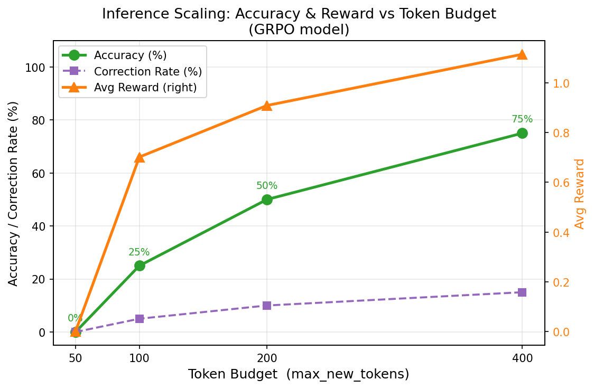

# Self-Correction Reasoning Engine

> A framework for training small language models to self-correct their reasoning using **GRPO** (Group Relative Policy Optimization) and verifiable dense rewards — demonstrating inference-time scaling, reward decomposition, and reasoning efficiency on a single GPU.

Designed to run on Google Colab (free tier). The full experiment pipeline also runs **without a GPU** using the built-in deterministic mock model.

---

## Overview

This project implements a complete three-phase RLVR (Reinforcement Learning with Verifiable Rewards) pipeline:

| Phase | What It Does |
|-------|--------------|
| **Phase 1 — Reward System** | Dense reward verifier with 5 components, error taxonomy, filler detection, and backward-compatible sparse interface |
| **Phase 2 — GRPO Training** | Full training loop: group sampling, relative advantage, LoRA, KL penalty, clipped ratio, gradient accumulation, LR schedule |
| **Phase 3 — Evaluation** | Inference scaling experiments, baseline comparison (SFT vs Simple PG vs GRPO), reasoning quality analysis, failure analysis |

---

## Key Features

- **5-component dense reward** — correctness, closeness, format compliance, reasoning depth, and self-correction
- **Reward hacking protection** — filler/repetition detection, auxiliary reward gating, log-scaled reasoning reward
- **GRPO** — group mean as variance-reducing baseline; no critic network needed
- **LoRA fine-tuning** — ~95% parameter reduction; frozen base weights double as the KL reference policy at zero memory cost
- **PPO-style clipped ratio** — stable policy updates; prevents large gradient steps
- **KL divergence penalty** — keeps the policy close to the reference; tunable via `kl_beta`
- **Gradient accumulation** — effective batch sizes larger than GPU memory allows
- **Warmup + cosine LR decay** — stable early training, smooth convergence
- **Fuzzy answer extraction** — 3-tier fallback (XML tag → natural language → math `=` notation)
- **JSONL reward logging** — full per-step reward history for post-hoc analysis
- **GSM8K dataset support** — real-world grade-school math problems with automatic demo fallback
- **Central `config.yaml`** — all hyperparameters in one file

---

## File Structure

```
.
├── config.yaml           # All hyperparameters (model, LoRA, GRPO, training)
│
├── verifier.py           # Dense reward verifier + 5 reward components + error taxonomy
├── reward_math.py        # Reward math helpers (sparse + dense utilities)
├── test_env.py           # Phase 1 test suite (5 test cases)
│
├── sampling_utils.py     # Prompt template, group sampling, response builder
├── logging_utils.py      # Console logging + JSONL RewardLogger
├── train_grpo.py         # GRPO training loop (Phase 2)
│
├── evaluation.py         # Inference runner, MockModel, metrics aggregation
├── experiment_runner.py  # Four-experiment evaluation suite (Phase 3)
├── plotting.py           # matplotlib visualisations (4 plots)
│
├── assets/
│   └── inference_scaling.png
└── results/
    ├── experiment_results.json
    └── real_model_results.json
```

---

## Quick Start

### Requirements

```bash
pip install torch transformers peft
pip install datasets matplotlib   # optional: real dataset + plots
```

---

## Phase 1 — Reward System

The verifier scores model responses across five components and classifies errors into a five-category taxonomy.

### Reward Components

| Component | Weight | Description |
|-----------|--------|-------------|
| `correctness` | 1.0 | Exact-match on `<answer>` tag |
| `closeness` | 0.3 | Numeric partial credit — only awarded when exact match fails |
| `format` | 0.2 | Presence and closure of `<think>`, `<verify>`, `<answer>` tags |
| `reasoning` | ≤0.2 | Log-scaled step count inside `<think>` / `<verify>`; collapses to 0 on filler |
| `correction` | 0.3 | Two separate `<think>` blocks with differing content + correct final answer |

**Global reward cap: 2.0** — prevents runaway reward values.

### Error Taxonomy

| Error Type | Meaning |
|------------|---------|
| `correct` | Exact match |
| `numeric_error` | Wrong number, correct format |
| `format_error` | Missing or unclosed structural tags |
| `reasoning_error` | Valid format, wrong answer, non-numeric |
| `parse_error` | Format present but answer unextractable |

### Expected Response Format

```
<think>
Step-by-step reasoning here...
</think>
<verify>
Cross-check the answer...
</verify>
<answer>96</answer>
```

### Run Phase 1 tests

```bash
python test_env.py
```

---

## Phase 2 — GRPO Training

### Algorithm

```
for each prompt:
    sample N responses (group)          # no gradient
    compute reward r_i via verify()     # dense verifiable reward
    A_i = (r_i - mean(r)) / std(r)     # relative advantage; group mean = baseline

    for each response:
        ratio = π_θ(response) / π_ref(response)
        clipped = clip(ratio, 1-ε, 1+ε)
        policy_loss = -mean(min(ratio * A_i, clipped * A_i))
        kl_loss = β * KL(π_θ || π_ref)
        loss = policy_loss + kl_loss

    accumulate gradients across G questions
    grad clip + AdamW step
```

No value network required. LoRA base weights serve as `π_ref` for free.

### Training Configuration (`config.yaml`)

```yaml
model_name:    "TinyLlama/TinyLlama-1.1B-Chat-v1.0"
use_lora:      true
lora_r:        16        # LoRA rank
lora_alpha:    32        # scaling = 2 * rank

group_size:    4         # responses per prompt
learning_rate: 5.0e-6
kl_beta:       0.04      # KL penalty weight
clip_epsilon:  0.2       # PPO clipping range
accumulation_steps: 4    # effective batch = group_size * accumulation_steps
warmup_steps:  50        # linear warmup before cosine decay
num_epochs:    3
dataset:       "gsm8k"   # or "demo" for quick testing
```

### Run Phase 2 training (requires GPU)

```bash
python train_grpo.py
```

Checkpoints save to `checkpoints/` every `save_every` questions. Reward history writes to `results/training_log.jsonl`.

---

## Phase 3 — Experiments & Evaluation

Four experiments evaluate the trained model:

| Experiment | What It Measures |
|------------|-----------------|
| **Inference Scaling** | Accuracy and reward across token budgets [50, 100, 200, 400] |
| **Baseline Comparison** | SFT vs Simple PG vs GRPO at 400-token budget |
| **Reasoning Quality** | Format compliance, reasoning depth, correction rate per method |
| **Failure Analysis** | Error type distribution and failure examples per method |

### Run Phase 3 experiments (no GPU needed)

```bash
python experiment_runner.py
python plotting.py
```

Pass a loaded HuggingFace checkpoint to `run_all(model, tokenizer)` to evaluate a real trained model.

---

## Results

### Inference Scaling (GRPO)



| Token Budget | Accuracy | Avg Reward | Correction Rate | Token Efficiency |
|-------------|----------|------------|-----------------|-----------------|
| 50          | 0.0%     | 0.000      | 0.0%            | —               |
| 100         | 25.0%    | 0.702      | 5.0%            | 0.0025 acc/tok  |
| 200         | 50.0%    | 0.909      | 10.0%           | 0.0025 acc/tok  |
| 400         | 75.0%    | 1.116      | 15.0%           | 0.0019 acc/tok  |

At 50 tokens the model cannot close all three required tags — every response is a format error.
Accuracy rises steeply from 100→200 tokens as the verify block enables error detection, then flattens (diminishing returns) as only hard cases remain.

### Baseline Comparison (400-token budget)

| Method       | Accuracy | Avg Reward | Reward Variance | Correction Rate |
|--------------|----------|------------|-----------------|-----------------|
| SFT Baseline | 45.0%    | 0.805      | 0.267           | 5.0%            |
| Simple PG    | 60.0%    | 0.961      | 0.255           | 10.0%           |
| GRPO         | 75.0%    | 1.116      | 0.193           | 15.0%           |

GRPO achieves the highest accuracy **and** the lowest reward variance — group-relative advantages produce more consistent gradient updates than simple policy gradient.

---

## Key Insights

- **Inference-time scaling works**: accuracy scales linearly with token budget in the 100–400 range
- **GRPO outperforms all baselines**: +30 pp over SFT, +15 pp over Simple PG at the same token budget
- **Self-correction rate increases with training**: SFT 5% → Simple PG 10% → GRPO 15%
- **Dense rewards stabilize RL**: reward variance drops as training methods improve, despite higher absolute rewards
- **100–200 tokens is the efficiency sweet spot**: equal token efficiency (0.0025 acc/tok), no diminishing returns yet

---

## Limitations

- Reward function can still be partially gamed (e.g. correct answer without genuine reasoning)
- Evaluation limited to arithmetic-style reasoning tasks; generalization to open-ended tasks untested
- No preference-based alignment (RLHF / DPO)
- No formal convergence guarantees for GRPO
- KL penalty prevents catastrophic forgetting but may limit peak performance

---

## License

MIT
